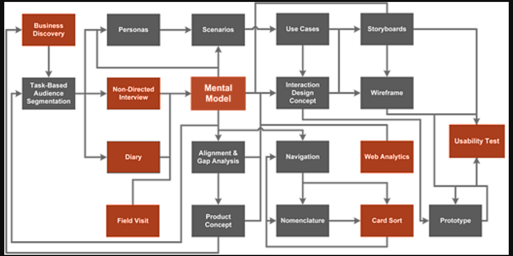
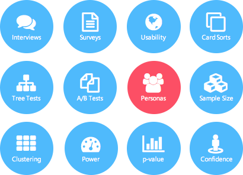

==================
# SQUAD: GeekDesign

# INTEGRANTES:  
- Anaís
- Silvia
- Mariela
- Victoria
- Quiñones Jauregui, Yenny Elizabeth - yenny.quinones.jauregui@gmail.com

# TEMA
- Qué es UX Reseach
- Research cuantitativo
- Research cualitativo

## Qué es UX Research

- La investigación tiene dos partes: recopilar datos y sintetizar esos datos para mejorar la usabilidad.
- Al comienzo del proyecto, la investigación de diseño se centra en aprender sobre los requisitos del proyecto de los interesados ​​y en conocer las necesidades y los objetivos de los usuarios finales.
- Los investigadores realizarán entrevistas, recopilarán encuestas, observarán prospectos o usuarios actuales, y revisarán literatura, datos o análisis existentes.
- Luego, iterativamente a lo largo del proceso de diseño, el foco de la investigación cambia a la usabilidad y el sentimiento. 
- Los investigadores pueden realizar pruebas de usabilidad o pruebas A / B, entrevistar a los usuarios sobre el proceso y, en general, probar suposiciones que mejorarán los diseños.

Estas son las cinco preguntas clave que debe considerar al definir su plan de investigación UX:
1. Objetivos. ¿Cuáles son las lagunas de conocimiento clave que debemos tener en cuenta?
1. Hipótesis ¿Qué creemos que comprendemos acerca de nuestros usuarios?
2. Métodos. En función del tiempo y la mano de obra, ¿qué métodos deberíamos seleccionar?
3. Conducta. Reúna datos a través de los métodos seleccionados.
4. Sintetizar Completa las lagunas de conocimiento, comprueba o refuta nuestras hipótesis y descubre oportunidades para nuestros esfuerzos de diseño.

### Metodologías comunes
Los diversos tipos de investigación UX van desde entrevistas en persona hasta pruebas A / B no moderadas (y todo lo demás), aunque son consistentes en que todas se derivan de las mismas metodologías clave: observación, comprensión y análisis.

#### Observación
- El primer paso para realizar una investigación es aprender a observar el mundo que nos rodea.
- Al igual que los fotógrafos principiantes, los investigadores principiantes deben aprender a ver. 
- Deben notar los tics nerviosos que pueden indicar que sus entrevistados están estresados ​​o son inciertos, y retomar referencias aparentemente menores que pueden reflejar creencias o pensamientos arraigados que deberían ser probados.
- La observación puede parecer una habilidad simple, pero puede nublarse por prejuicios inconscientes, que todos tienen. 
- Los investigadores de diseño se entrenan para observar y tomar notas para luego poder encontrar patrones en grupos de personas aparentemente diversos.

#### Comprensión
- Al igual que la observación, la comprensión es algo que hacemos todo el tiempo en nuestra vida cotidiana.
- Nos esforzamos por comprender a nuestros compañeros de trabajo, nuestras familias y nuestros amigos, a menudo tratando de comprender un punto de discordia o un concepto desconocido. 
- Pero para los investigadores de UX, la comprensión tiene menos que ver con los desacuerdos y más con los modelos mentales.

##### Un modelo mental
- Es la imagen que alguien tiene en mente cuando piensa en una frase o situación en particular. 
- El modelo mental informa las decisiones que tomamos.
- Los investigadores de diseño deben comprender los modelos mentales de las personas que entrevistan o evalúan, por dos razones: 
* Primero, todos hablamos en taquigrafía a veces. Los investigadores deben reconocer esa taquigrafía basada en el modelo mental del hablante. 
* Segundo, si el investigador puede identificar con precisión el modelo mental del usuario, él o ella puede compartir esta información con el equipo de diseño y diseñar para acomodar el modelo.

#### Análisis
- La investigación en sí misma puede ser valiosa, pero con el fin de utilizar los conocimientos para informar el diseño, debe analizarse y finalmente presentarse a un equipo más grande. 
- El análisis es el proceso mediante el cual el investigador identifica los patrones en la investigación, propone posibles razones o soluciones, y hace recomendaciones.
- Algunas técnicas de análisis incluyen la creación de personajes o escenarios, la descripción de modelos mentales o el suministro de cuadros y gráficos que representan las estadísticas y los comportamientos de los usuarios.
- Aunque las técnicas descritas aquí se centran principalmente en la realización de investigaciones, es importante recordar que la investigación solo es valiosa si se comparte .
- No le sirve de nada a nadie cuando está encerrado en un armario, u olvidado por la emoción del diseño.

## Técnicas cuantitativas

La investigación cuantitativa es cualquier investigación que se puede medir numéricamente. Responde a preguntas tales como "¿a cuántas personas hizo clic aquí?". Es valioso para comprender las probabilidades estadísticas y lo que está sucediendo en un sitio o en una aplicación.

1. Uso de estadísticas sobre el tamaño de muestra  pequeño: las muestras pequeñas no siempre funcionan en todas las situaciones excepto para evaluaciones iniciales rápidas, es una forma efectiva de identificar algunas grandes diferencias en el diseño, el flujo o la estrategia.
2. Poder  : es la capacidad o el nivel de confianza para detectar diferencias entre varios estudios. Cuanta más potencia, más probable es que encuentre las pequeñas diferencias entre varios estudios.
3. El valor p  , o más claramente el valor de probabilidad, es una forma de medir la posibilidad de que las diferencias entre diferentes productos o diseños que observaron los usuarios de la prueba se debieron a una casualidad o coincidencia. Bajar el porcentaje significa que la diferencia observada no se debe al azar, por lo que es estadísticamente significativa.
4. Tamaño de muestra  : existen múltiples técnicas para calcular un tamaño de muestra. Todo depende del grado de diferencias y cambios que intenta capturar, la precisión de estos cambios y el margen de error aceptable.
5. Los intervalos de confianza y los niveles de confianza generalmente se usan para los cálculos de tamaño de muestra. Según el tiempo, el presupuesto y los recursos, la mayoría de los equipos tienen un intervalo de confianza del 90-95% con un margen de error del 5-10%.

## Técnicas cualitativas
La investigación cualitativa a veces se denomina investigación "blanda". Nos ayuda a comprender por qué las personas hacen lo que hacen y, a menudo, toma la forma de entrevistas o conversaciones. Las preguntas comunes incluyen " por qué las personas no vieron el llamado a la acción" y " ¿qué más notaron las personas en la página?"

1. Entrevistas : generalmente cubre tres tipos de entrevistas:
a) entrevistas dirigidas donde el investigador hace preguntas específicas a los usuarios e intenta comparar las respuestas con otros usuarios.
b) entrevistas no dirigidas donde el investigador intenta tener más de una discusión general con el usuario (s)
c) entrevistas etnográficas donde el investigador observa al usuario (s) en su propio entorno para comprender cómo abordan ciertos aspectos, realizar ciertas tareas.
2. Encuestas y cuestionarios : son una forma rápida de recopilar información de un gran número de usuarios, pero su limitación obvia es la falta de interacción entre el investigador y los usuarios.
3. Pruebas de usabilidad:implica pedirle a los usuarios que utilicen la aplicación / producto para lograr ciertos objetivos.Hay tres variaciones de tales pruebas:
a) pruebas moderadas: donde los usuarios ingresan al laboratorio y se les asignan tareas o pruebas específicas para realizar.
b) prueba no moderada: donde los usuarios completan la prueba en su propio tiempo, normalmente de forma remota.
c) pruebas de guerrilla : una forma de prueba más informal en la que se solicita a los usuarios aleatorios en una ubicación social o comunitaria que usen la aplicación / producto y brinden retroalimentación informal.
4. Clasificaciones de tarjetas : el objetivo principal de una prueba de clasificación de tarjetas es comprender cómo los usuarios perciben las relaciones y la jerarquía entre varios contenidos, categorías y otra información. Esto se usa generalmente para generar arquitecturas de información o mapas de sitios apropiados.
5. Pruebas de árbol: similar al ordenamiento de tarjetas, el objetivo principal es comprobar si el producto / aplicación tiene el nivel apropiado de información que se está diseñando dentro del producto.
6. Pruebas A / B : se centra en proporcionar al usuario dos o más opciones y documentar las preferencias del usuario entre las opciones. También hay pruebas de pruebas A / B avanzadas o enfocadas en aspectos específicos del producto, tales como Elementos de diseño, Jerarquía de información, Navegación y más.
7. Desarrollo de Persona  : como se describió anteriormente, es esencialmente una representación de un grupo de un usuario que exhibe un patrón muy similar en términos de comportamiento de uso de la aplicación independientemente de su edad, sexo, ubicación, educación y profesión.

## Links de Referencia
- https://medium.com/ux-design-web-mobile-virtual-reality/12-ux-research-techniques-quantitative-and-qualitative-1a37bcb1914e
- http://www.uxbooth.com/articles/complete-beginners-guide-to-design-research/#what
- https://www.smashingmagazine.com/2009/10/15-common-mistakes-in-e-commerce-design-and-how-to-avoid-them/
- https://uxplanet.org/how-to-choose-a-user-research-method-985112051d84
- https://www.nngroup.com/articles/ux-research-cheat-sheet/